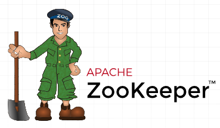

# Intro 3 — Kafka 4 Architecture

Elephant Scale

---

## Agenda

- The Kafka cluster: brokers and the controller
- **KRaft** — ZooKeeper-free Kafka (what changed and why it matters)
- The Kafka ecosystem: Connect, Streams, Schema Registry, Flink

---

## The Cluster: A Set of Brokers

A Kafka cluster is just a group of **brokers** that coordinate to serve one set of
topics.

- Each **broker** stores some partitions and handles reads/writes for the partitions it leads
- Partitions and their replicas are **spread across brokers** for scale and fault tolerance
- Clients connect to any broker (the **bootstrap server**) and discover the rest automatically

```
                 Kafka cluster
   ┌──────────┬──────────┬──────────┐
   │ broker 1 │ broker 2 │ broker 3 │
   │ P0(L) P3 │ P1(L) P0 │ P2(L) P1 │   (L = leader replica)
   └──────────┴──────────┴──────────┘
        ▲            ▲          ▲
        └──── clients connect to any broker ────┘
```

Our lab cluster is exactly this: **three brokers** as Docker containers.

Notes:
"Bootstrap" only means the first contact point. The client immediately pulls full cluster metadata and then talks directly to the right leader for each partition.

---

## Someone Has to Be in Charge: The Controller

A cluster needs coordination — who leads each partition, which brokers are alive,
what topics exist. That job is the **controller**.

- The **controller** manages cluster **metadata**: topic/partition configuration, replica
  assignments, and **leader election** when a broker fails
- It's not a separate machine — one of the brokers **acts as** the controller
- If the controller broker fails, another takes over

The interesting question is: **where is that metadata stored, and how is it kept
consistent?** That's exactly what changed in Kafka 4.

---

## The Old World: Kafka + ZooKeeper

For most of Kafka's history, that metadata lived in a **separate system: Apache
ZooKeeper**.

```
   ┌─────────────┐         ┌──────────────────────────┐
   │  ZooKeeper  │◄───────►│  Kafka brokers           │
   │  ensemble   │ metadata│  (data: your topics)     │
   │ (3-5 nodes) │         │                          │
   └─────────────┘         └──────────────────────────┘
   cluster metadata          the actual event data
```

- ZooKeeper held cluster state; brokers held the data
- **Two distributed systems** to install, configure, secure, monitor, and upgrade
- Metadata had a scaling ceiling — very large clusters strained ZooKeeper
- Failover and metadata propagation could be slow

**It worked for years — but it was a second system to operate, and a bottleneck.**



Notes:
If anyone in the room has run Kafka before, this slide is where they nod. Ask who has operated a ZooKeeper ensemble — the war stories sell the next slide better than you can.

---

## Kafka 4: KRaft — ZooKeeper Is Gone

**Apache Kafka 4 removes ZooKeeper entirely.** Kafka now manages its own metadata
using a built-in consensus protocol called **KRaft** (**K**afka **Raft**).

```
   ┌───────────────────────────────────────────┐
   │  Kafka cluster (KRaft)                     │
   │  ┌────────────┐   ┌──────────────────────┐ │
   │  │ controllers│   │ brokers              │ │
   │  │ (metadata  │   │ (your topic data)    │ │
   │  │  quorum)   │   │                      │ │
   │  └────────────┘   └──────────────────────┘ │
   └───────────────────────────────────────────┘
        one system — no ZooKeeper
```

- Metadata is stored **in Kafka itself**, in an internal metadata log
- A quorum of **controllers** agrees on that log using the **Raft** consensus algorithm
- **One system to run**, not two

Notes:
KRaft has been production-ready for a while; Kafka 4 is the release that makes it the *only* option. If a student has ZooKeeper-era experience, this is the headline change.

---

## Metadata as a Log

The elegant part: Kafka applies its **own** core idea — the log — to metadata.

- Cluster metadata is itself an **append-only log** (the metadata topic)
- Controllers form a **Raft quorum** and agree on the order of metadata changes
- Brokers **subscribe** to the metadata log and stay up to date, just like a consumer
- The **active controller** is the quorum leader; if it fails, the quorum elects a new one

This is why KRaft scales: propagating metadata is now the same fast, log-based
mechanism Kafka already does extremely well.

---

## Roles: Broker and Controller

In KRaft, a node runs in one (or both) of two **process roles**:

- **broker** — stores partition data, serves producers and consumers
- **controller** — participates in the metadata quorum

Two common topologies:

```
Production (separate roles)        Dev / small (combined)
  controllers: 3 dedicated nodes     each node is BOTH
  brokers:     N data nodes          broker + controller
                                     (our lab: 3 combined nodes)
```

- **Dedicated** controllers are typical for large production clusters
- **Combined** broker+controller nodes are simpler for development — exactly our lab setup

Notes:
Point at the lab's docker-compose — `KAFKA_PROCESS_ROLES: "broker,controller"` is this slide made real.

---

## Why KRaft Matters — Even to Developers

You won't administer the controller quorum, but KRaft changes things you'll feel:

- **Simpler environments** — one system to spin up; our whole cluster is a single compose file
- **Faster recovery** — leader election and metadata failover are quicker
- **Higher scale** — clusters support far more partitions than the ZooKeeper era
- **Current knowledge** — you learn today's architecture, not legacy patterns to unlearn

**Practical upshot:** if you read an older tutorial that mentions ZooKeeper, `zookeeper.connect`,
or `--zookeeper` flags — it's out of date. Kafka 4 is ZooKeeper-free.

---

## Kafka Is More Than Brokers: The Ecosystem

The brokers are the core, but real systems use the surrounding **ecosystem** —
which is where developers spend most of their time.

```
                    ┌───────────────────────┐
     Connect ──────►│                       │◄────── Connect
   (data in)        │   Kafka brokers       │      (data out)
                    │   (topics, the log)   │
   Schema Registry ─┤                       ├─ Streams / Flink
   (data contracts) └───────────────────────┘  (process in motion)
```

Each of these is a module later in the course. Here's the one-line orientation for
each.

---

## Kafka Connect

**Move data in and out of Kafka without writing code.**

- A framework of ready-made **connectors**: databases, object storage (S3), search, and more
- **Source** connectors pull data *into* Kafka; **sink** connectors push data *out*
- Configuration-driven — you submit JSON, not a custom app
- Handles scaling, offset tracking, retries, and dead-letter queues for you

*→ Module 9 (Kafka Connect), with a hands-on source + sink + DLQ lab.*

---

## Schema Registry

**Keep producers and consumers agreeing on the shape of the data.**

- A service that stores **schemas** (Avro, Protobuf, JSON Schema) and hands out schema IDs
- Producers and consumers serialize/deserialize against a registered schema
- Enforces **compatibility** as schemas evolve, so a producer change can't silently break consumers
- Turns "what's in this topic?" into a governed **data contract**

*→ Module 8 (Serialization & Schema Registry), with an Avro evolve-a-schema lab.*

---

## Stream Processing: Kafka Streams & Flink

**Transform, join, and aggregate streams as they flow — not in a nightly batch.**

- **Kafka Streams** — a Java library for stateful processing built into applications
  (`KStream` / `KTable`, joins, windows, exactly-once)
- **Apache Flink (Flink SQL)** — a powerful stream processor; write continuous queries in **SQL**,
  the modern successor to KSQL/ksqlDB
- Both read from Kafka topics, process continuously, and write results back to Kafka

*→ Module 10 (Stream Processing), with a stateful streaming lab.*

---

## The Full Picture

```
   Sources          Kafka 4 cluster (KRaft)          Sinks
  ┌────────┐   ┌──────────────────────────────┐   ┌──────────┐
  │ apps   │──►│ brokers (data) + controllers  │──►│ services │
  │  DBs   │─C─│    metadata via Raft log      │─C─│  DW / S3 │
  │ clicks │──►│                               │──►│  search  │
  └────────┘   └──────────────────────────────┘   └──────────┘
        C = Kafka Connect        Schema Registry governs data shape
                    Streams / Flink process in motion
```

- **KRaft** at the core: one system, no ZooKeeper
- **Connect** at the edges, **Schema Registry** for contracts, **Streams/Flink** for processing
- You'll write code against all of it — starting hands-on in the **next module**

---

## Summary

- A cluster is **brokers** (data) plus a **controller** role (metadata + leader election)
- **Kafka 4 removed ZooKeeper**; metadata now lives in Kafka via the **KRaft** (Raft) quorum
- Metadata is itself a **log** — the same idea that powers topics
- Nodes run as **broker**, **controller**, or (in dev) **both** — our lab uses 3 combined nodes
- The **ecosystem** — Connect, Schema Registry, Streams/Flink — is where developers live; each has its own module
- Next: **hands-on** — start the cluster, create topics, produce and consume
